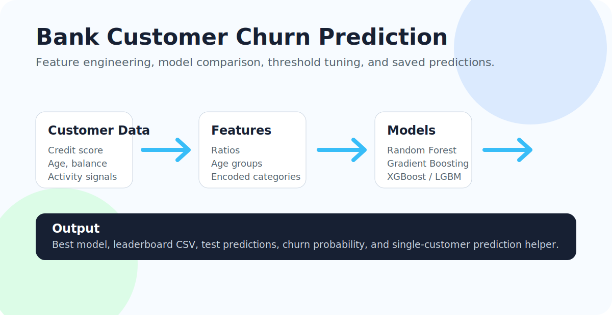

# Bank Customer Churn Prediction

Machine learning project for predicting whether a bank customer will stay with the bank or churn. The pipeline loads the classic `Churn_Modelling.csv` dataset, engineers useful customer features, trains multiple classifiers, compares them with business-relevant metrics, and saves the best model.



## Project Snapshot

| Area | Detail |
| --- | --- |
| Experience | End-to-end churn modeling pipeline |
| Core system | Feature engineering, model comparison, metrics, saved artifacts, single-customer prediction |
| Design signal | Pipeline preview plus business-readable problem, metrics, and outputs |
| Quality signal | Requirements file, reproducible script, deployment and fairness limitations |

## Problem

Customer churn is expensive. This project predicts the `Exited` target:

- `Exited = 0`: customer continued with the bank.
- `Exited = 1`: customer left the bank.

The goal is not only accuracy. The model should also surface churn risk in a way that supports retention decisions.

## Dataset

The project expects the classic Kaggle bank churn dataset.

Expected columns:

- `CreditScore`
- `Geography`
- `Gender`
- `Age`
- `Tenure`
- `Balance`
- `NumOfProducts`
- `HasCrCard`
- `IsActiveMember`
- `EstimatedSalary`
- `Exited`

If the CSV is not found locally, the script attempts to download a fallback copy using KaggleHub.

## Feature Engineering

The training script adds:

- `BalanceSalaryRatio`
- `AgeTenureRatio`
- `BalancePerProduct`
- `IsZeroBalance`
- `AgeGroup`
- `CreditScoreGroup`

It also handles missing values, categorical encoding, scaling, duplicate removal, and train/test splitting.

## Models Compared

- Logistic Regression
- Random Forest
- Extra Trees
- Gradient Boosting
- HistGradientBoosting
- XGBoost, if installed
- LightGBM, if installed

The script evaluates models and selects the best performer using ROC-AUC, F1 score, average Dice score, and accuracy.

## Metrics

The script prints:

- Accuracy
- Precision
- Recall
- F1 score
- ROC-AUC
- Average precision
- Confusion matrix
- Dice score for continued customers
- Dice score for churned customers
- Average Dice score

## Quick Start

Install dependencies:

```bash
pip install -r requirements.txt
```

Put `Churn_Modelling.csv` in the project folder, then run:

```bash
python bank_churn_model.py
```

## Run On Kaggle

Add the dataset as notebook input, then run:

```bash
python bank_churn_model.py
```

## Output Files

The script creates:

```text
outputs/
  bank_churn_model.joblib
  model_leaderboard.csv
  test_predictions.csv
```

## Predict One Customer

```python
from bank_churn_model import predict_customer

customer = {
    "CreditScore": 650,
    "Geography": "Spain",
    "Gender": "Male",
    "Age": 42,
    "Tenure": 6,
    "Balance": 80000.0,
    "NumOfProducts": 2,
    "HasCrCard": 1,
    "IsActiveMember": 1,
    "EstimatedSalary": 90000.0,
}

print(predict_customer(customer))
```

## Repository Structure

```text
bank-customer-churn-prediction/
  bank_churn_model.py
  requirements.txt
  README.md
  docs/
    readme-preview.svg
```

## Notes

- This is a learning and portfolio project, not a production credit-risk or banking decision system.
- Real banking deployment would require fairness review, explainability, monitoring, privacy controls, and compliance review.

## User Experience

The training script reports a four-stage progress flow, presents a compact decision summary, labels every generated artifact, and ends with the human-review step that matters most. See the [model workflow experience guide](docs/USER_EXPERIENCE.md) for output semantics, error recovery, and accessible reporting guidance.

