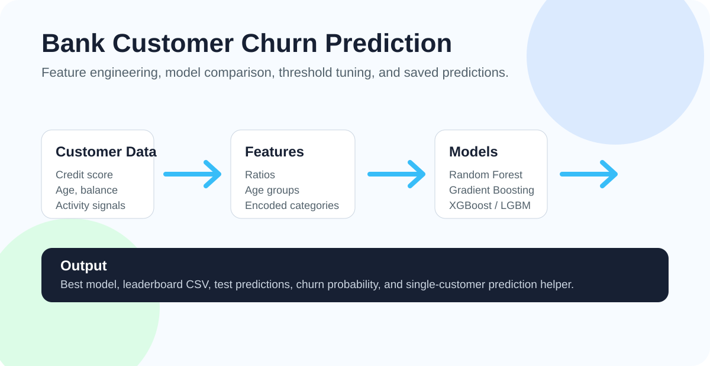

# Bank Customer Churn Prediction

[](https://github.com/shauryamalhotra957-wq/bank-customer-churn-prediction/actions) [](https://opensource.org/licenses/MIT)


Machine learning project for predicting whether a bank customer will stay with the bank or churn. The pipeline loads the classic `Churn_Modelling.csv` dataset, engineers useful customer features, trains multiple classifiers, compares them with business-relevant metrics, and saves the best model.



## Project Snapshot

| Area | Detail |
| --- | --- |
| Experience | End-to-end churn modeling pipeline |
| Core system | Feature engineering, model comparison, metrics, saved artifacts, single-customer prediction |
| Design signal | Pipeline preview plus business-readable problem, metrics, and outputs |
| Quality signal | Held-out test evaluation, unit-test CI, reproducible script, deployment and fairness limitations |

## Problem

Customer churn is expensive. This project predicts the `Exited` target:

- `Exited = 0`: customer continued with the bank.
- `Exited = 1`: customer left the bank.

The goal is not only accuracy. The model should also surface churn risk in a way that supports retention decisions.

## Dataset

The project expects the classic Kaggle bank churn dataset.

Expected columns:

- `CreditScore`
- `Geography`
- `Gender`
- `Age`
- `Tenure`
- `Balance`
- `NumOfProducts`
- `HasCrCard`
- `IsActiveMember`
- `EstimatedSalary`
- `Exited`

If the CSV is not found locally, the script attempts to download a fallback copy using KaggleHub.

## Feature Engineering

The training script adds:

- `BalanceSalaryRatio`
- `AgeTenureRatio`
- `BalancePerProduct`
- `IsZeroBalance`
- `AgeGroup`
- `CreditScoreGroup`

It also handles missing values, categorical encoding, scaling, duplicate removal, and stratified train/validation/test splitting.

## Evaluation Design

The pipeline keeps the test split isolated until the end:

1. Split the data into training and held-out test sets.
2. Split the training portion again into train and validation sets.
3. Fit each candidate on the train split.
4. Tune its classification threshold and compare models using validation metrics only.
5. Refit the selected model on the full non-test training data.
6. Evaluate exactly once on the untouched test split.

This avoids using test-set performance to choose the model, which would make the final score optimistically biased.

## Models Compared

Core models:

- Logistic Regression
- Random Forest
- Extra Trees
- Gradient Boosting
- HistGradientBoosting

Optional models, used automatically when installed:

- XGBoost
- LightGBM

## Metrics

The validation leaderboard and final held-out test summary include:

- Accuracy
- Precision
- Recall
- F1 score
- ROC-AUC
- Average precision
- Confusion matrix
- Dice score for continued customers
- Dice score for churned customers
- Average Dice score

## Quick Start

Install the core dependencies:

```bash
pip install -r requirements.txt
```

To include XGBoost and LightGBM as extra candidates:

```bash
pip install -r requirements-optional.txt
```

Put `Churn_Modelling.csv` in the project folder, then run:

```bash
python bank_churn_model.py
```

## Run Tests

```bash
python -m unittest discover -s tests -v
```

GitHub Actions runs the same unit-test suite for pushes and pull requests.

## Run On Kaggle

Add the dataset as notebook input, then run:

```bash
python bank_churn_model.py
```

## Output Files

The script creates:

```text
outputs/
  bank_churn_model.joblib
  model_leaderboard.csv
  test_predictions.csv
```

`model_leaderboard.csv` contains **validation** metrics used for model selection. The console summary and `test_predictions.csv` come from the final untouched test split.

## Predict One Customer

```python
from bank_churn_model import predict_customer

customer = {
    "CreditScore": 650,
    "Geography": "Spain",
    "Gender": "Male",
    "Age": 42,
    "Tenure": 6,
    "Balance": 80000.0,
    "NumOfProducts": 2,
    "HasCrCard": 1,
    "IsActiveMember": 1,
    "EstimatedSalary": 90000.0,
}

print(predict_customer(customer))
```

## Repository Structure

```text
bank-customer-churn-prediction/
  bank_churn_model.py
  requirements.txt
  requirements-optional.txt
  tests/
    test_bank_churn_model.py
  .github/
    workflows/
      tests.yml
  README.md
  docs/
    readme-preview.svg
```

## Notes

- This is a learning and portfolio project, not a production credit-risk or banking decision system.
- Real banking deployment would require fairness review, explainability, monitoring, privacy controls, and compliance review.

## User Experience

The training script reports a four-stage progress flow, presents a compact decision summary, labels every generated artifact, and ends with the human-review step that matters most. See the [model workflow experience guide](docs/USER_EXPERIENCE.md) for output semantics, error recovery, and accessible reporting guidance.